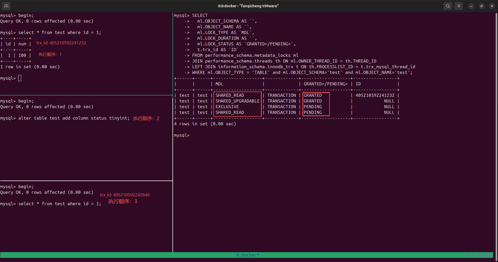
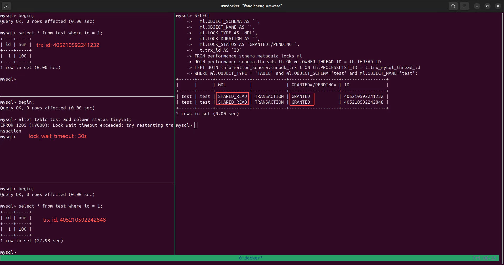
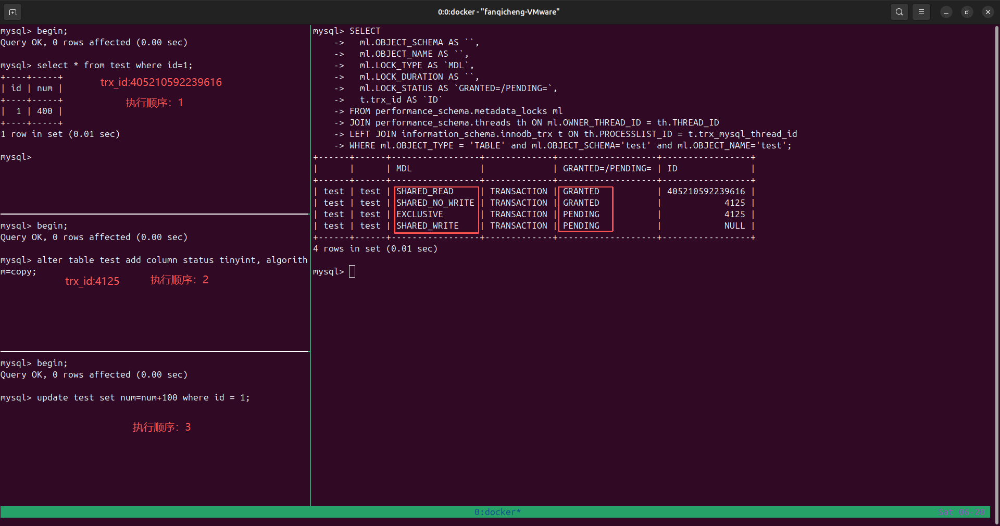
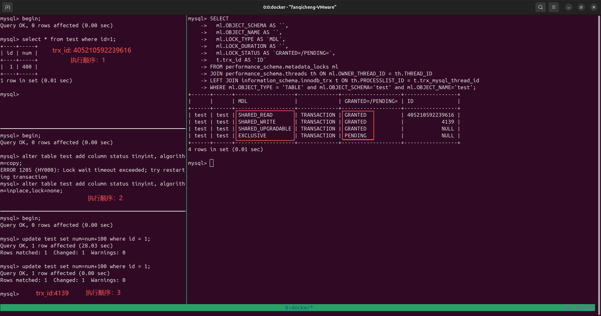
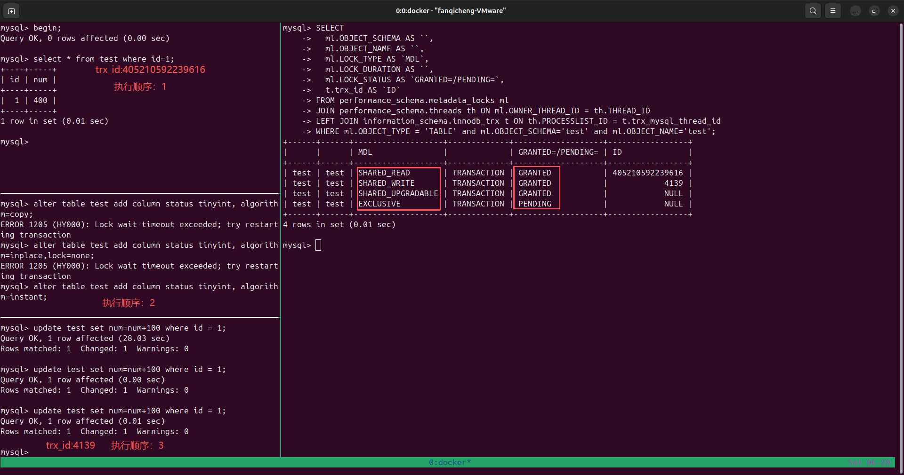
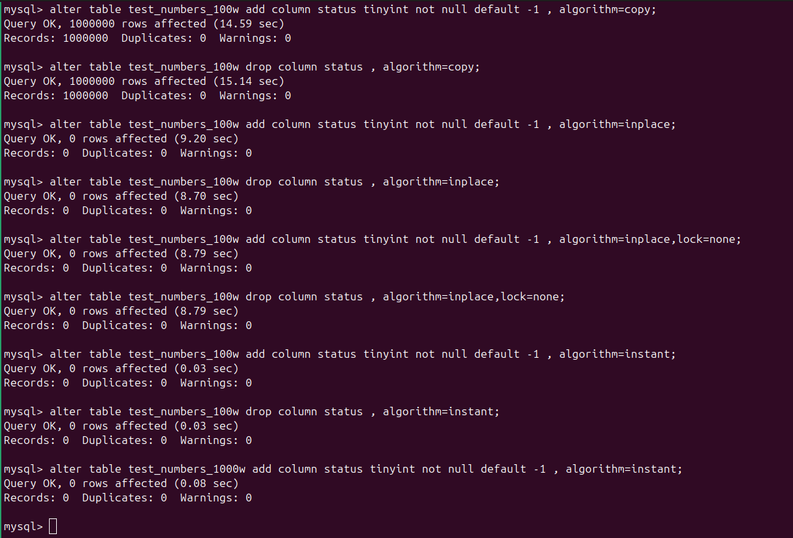

# 线上表新增字段实验

## 前置准备

### mysql准备
拉取`8.0`版本的`mysql`，并启动
```shell
docker pull mysql:8.0
docker run -itd --name m8.0 -e MYSQL_ROOT_PASSWORD=<password> mysql:8.0
# 实际版本8.0.46
```

### 理论知识准备`MDL`
【`MDL` 锁类型】

| 锁全称 | 简称 | 适用对象 | 产生场景 | 兼容性说明 |
| --- | --- | --- | --- | --- |
| `INTENTION_EXCLUSIVE` | `IX` | `GLOBAL / SCHEMA`（库层级，表上几乎看不到） | 访问库内任意表前，先在库上加意向排他锁 | 与 `S`、`SH`、`SR`、`SW`、`SU` 兼容；与 `X` 互斥 |
| `SHARED` | `S` | `TABLE` | 仅拷贝表结构、仅读取元数据不访问数据（`CREATE TABLE ... LIKE`） | 兼容各类共享锁，阻塞 `X` 排他锁 |
| `SHARED_HIGH_PRIO` | `SH` | `TABLE` | 查询 `information_schema` 系统表、元数据查询 | 高优先级，不受等待中 `X` 锁阻塞，兼容 `SR/SW/SU` |
| `SHARED_READ` | `SR` | `TABLE` | 普通快照读 `SELECT`（不加锁查询） | `SR/SW/SU` 互相兼容；阻塞 `EXCLUSIVE (X)` |
| `SHARED_WRITE` | `SW` | `TABLE` | `INSERT / UPDATE / DELETE / SELECT ... FOR UPDATE` 等 DML、加锁读 | `SR/SW/SU` 互相兼容；阻塞 `EXCLUSIVE (X)` |
| `SHARED_UPGRADABLE` | `SU` | `TABLE` | `Online DDL` 在线修改表（加 / 删索引等 `ALTER`）第一阶段 | 完全兼容 `SR`、`SW`，业务读写不受阻塞；后期可升级为更强锁 |
| `SHARED_NO_WRITE` | `SNW` | `TABLE` | `Online DDL` 中间过渡阶段 | 仅允许 `SR` 查询，阻塞 `SW`、`X` 写操作 |
| `SHARED_NO_READ_WRITE` | `SNRW` | `TABLE` | `Online DDL` 切换表结构短时过渡锁 | 阻塞所有 DML、普通 `SELECT`，仅瞬时持有 |
| `EXCLUSIVE` | `X` | `TABLE` | `DROP`、`RENAME`、`TRUNCATE`、普通 `ALTER`、`LOCK TABLES WRITE` | 和所有 `MDL` 锁互斥，持有期间阻塞全表读写 |

【准备测试库和测试表】
```shell
-- 1. 创建数据库 test
CREATE DATABASE IF NOT EXISTS test DEFAULT CHARACTER SET utf8mb4 COLLATE utf8mb4_unicode_ci;

-- 使用数据库
USE test;

-- 2. 创建数据表 test
CREATE TABLE IF NOT EXISTS `test` (
    id INT PRIMARY KEY AUTO_INCREMENT COMMENT '主键ID',
    num INT NOT NULL COMMENT '数字'
) ENGINE=InnoDB DEFAULT CHARSET=utf8mb4 COMMENT='测试表';

-- 3. 插入3条测试数据
INSERT INTO `test` (num) VALUES
(100),
(200),
(300);

-- 查询验证
SELECT * FROM `test`;
```
【隔离级别和锁等待时长查询】
```shell
# 隔离级别
SELECT @@transaction_isolation; # 会话
SELECT @@global.transaction_isolation; # 全局
# REPEATABLE-READ 
SET GLOBAL transaction_isolation = 'READ-COMMITTED';
SET SESSION transaction_isolation = 'READ-COMMITTED';

#-----------------
# MDL锁等待时长
SELECT @@lock_wait_timeout;
SELECT @@global.lock_wait_timeout;
# 31536000
SET SESSION innodb_lock_wait_timeout = 30;
SET GLOBAL innodb_lock_wait_timeout = 30;

# 查看MDL锁占用情况
SELECT
  ml.OBJECT_SCHEMA AS `数据库名`,
  ml.OBJECT_NAME AS `表名`,
  ml.LOCK_TYPE AS `MDL锁类型`,
  ml.LOCK_DURATION AS `锁生命周期`,
  ml.LOCK_STATUS AS `锁状态GRANTED=持有/PENDING=等待`,
  t.trx_id AS `事务ID`
FROM performance_schema.metadata_locks ml
JOIN performance_schema.threads th ON ml.OWNER_THREAD_ID = th.THREAD_ID
LEFT JOIN information_schema.innodb_trx t ON th.PROCESSLIST_ID = t.trx_mysql_thread_id
WHERE ml.OBJECT_TYPE = 'TABLE' and ml.OBJECT_SCHEMA='test' and ml.OBJECT_NAME='test';
# 查询会话的事务id
SELECT trx_id FROM information_schema.innodb_trx WHERE trx_mysql_thread_id = CONNECTION_ID();
```

【以mysql8.0为例，演示锁占用情况】
+ 事务1-`405210592241232`执行`select操作`
+ 事务2-执行`alter`操作
+ 事务3-`405210592242848`执行`select操作`

```
1. 事务1执行`select`之后持有`mdl`共享锁`shared_read`
2. 事务2欲执行`alter`，尝试持有`mdl`排他锁 -- 失败处于阻塞状态
3. 事务3欲执行`select`，尝试持有`mdl`共享锁`shared-read` -- 失败且处于阻塞状态
```
总结：`mdl`共享锁和`mdl`排他锁冲突；`alter`长时间阻塞会影响后续的`dml`有关数据的操作，不利用系统的性能


```
设置合理的`lock_wait_timeout` -- 事务2超时后自动放弃锁的抢夺
事务3的`select`得以执行 -- 如果此时有大量的`dml`数据读写操作会影响`alter`的执行
```

### 不同版本`alter`原理
```shell
# 5.6版本之前 -- copy
1.创建一个和原表结构相同的临时表(serve层)
2.扫描原表的数据并移动到临时表
3.临时表重命名提升为主表
数据移动的过程持有`MDL`排他锁，阻塞后续的读写操作
# 5.6版本及之后 -- online ddl inplace
1.创建临时文件(innodb层)
2.扫描主键数据页，重建B+树写入临时文件
3.重建过程中的增删改操作记录到日志(row log)
4.重建完成，将日志内容应用到临时文件
```
【不同algorithm】
```shell 
`alter table test add column status tinyint, ALGORITHM=INPLACE, LOCK=NONE;`
`alter table test add column status tinyint, ALGORITHM=INSTANT;` # 底层强制LOCK=NONE
```
| 算法    | 版本     | 原理                                        | 性能           | 允许并发 DML |
| ------- | -------- | ------------------------------------------- | -------------- | ------------ |
| INSTANT | 8.0+     | 只修改元数据，不碰数据页                    | 最快（毫秒级） | 是           |
| INPLACE | 5.6+     | 原地修改，Server 层不拷贝数据               | 中等           | 是           |
| COPY    | 5.6 之前 | 创建新表 -> 拷贝数据 -> 删旧表 -> 重命名     | 最慢           | 否           |

【不同LOCK】
| 值        | 说明                 | 允许的操作                 |
| --------- | -------------------- | -------------------------- |
| NONE      | 不加锁               | 允许所有 DML 操作          |
| SHARED    | 加读锁               | 允许读操作，禁止 DML       |
| DEFAULT   | 默认模式             | 在满足 DDL 前提下，尽可能允许并发 |
| EXCLUSIVE | 加写锁               | 禁止所有读写操作           |


【不同版本add|drop操作对应的algorithm】
| MySQL 版本区间 | INSTANT ADD COLUMN 规则 | INSTANT DROP COLUMN | 列位置限制 | 行版本计数器上限 | 语法约束 |
| -------------- | ----------------------- | ------------------- | ---------- | ---------------- | -------- |
| 8.0.12 ~ 8.0.28 | 仅支持在表末尾追加列 | 不支持，只能 INPLACE 重建表 | 不能使用 FIRST / AFTER xxx，中间插入会强制降级 INPLACE | 64 | ALGORITHM=INSTANT 不可搭配 LOCK=xxx 参数 |
| 8.0.29 及以上 | 支持任意位置：末尾、FIRST、AFTER 指定列 | 原生支持 INSTANT 删除列，仅修改元数据 | 无位置限制，物理存储顺序与逻辑展示顺序分离 | 64 | ALGORITHM=INSTANT 不可搭配 LOCK=xxx 参数 |

--------

| 操作             | INSTANT | INPLACE | 重建表 | 允许并发 DML | 仅修改元数据 |
| ---------------- | ------- | ------- | ------ | ------------ | ------------ |
| 设置列默认值     | Yes     | Yes     | No     | Yes          | Yes          |
| 设置列为 NULL    | No      | Yes     | Yes    | Yes          | No           |
| 设置列 NOT NULL  | No      | Yes     | Yes    | Yes          | No           |

【易混淆的操作】
```
1. ADD COLUMN xxx NOT NULL DEFAULT 常量
    新增列，自带默认值兜底 → 支持 INSTANT，仅改元数据，不扫全表。
2. MODIFY COLUMN old_col NOT NULL
    修改已有字段为非空 → 不支持 INSTANT，必须 INPLACE 全表扫描校验所有行是否存在 NULL，需要重建数据。
```

【mysql:8.0演示图-ddl对dml的影响】
+ `algorithm=copy`

+ `algorithm=inplace`

+ `algorithm=instant`



【官方文档】
+ [InnoDB and Online DDL](https://dev.mysql.com/doc/refman/8.0/en/innodb-online-ddl.html)
+ [MySQL 8.0 INSTANT ADD and DROP Column(s) ](https://dev.mysql.com/blog-archive/mysql-8-0-instant-add-and-drop-columns/)
### 数据准备
【百万级别数据表】
`mysql/bash/create_test_100w.sh`
总耗时：mysql:5.7-15s  mysql:8.0-26s
【千万级别数据表】
`mysql/bash/create_test_1000w.sh`
总耗时：mysql:5.7-175s  mysql:8.0-246s

## 百万级别数据测试


| 操作类型 | 执行算法 | 总耗时 | 影响行数 | 核心执行特征 |
| ---- | ---- | ---- | ---- | ---- |
| 新增列（ADD COLUMN） | ALGORITHM=COPY | 14.59 秒 | 1000000 行 | 全表拷贝重建，扫描并改写所有存量行 |
| 删除列（DROP COLUMN） | ALGORITHM=COPY | 15.14 秒 | 1000000 行 | 全表拷贝重建，扫描并改写所有存量行 |
| 新增列（ADD COLUMN） | ALGORITHM=INPLACE | 9.20 秒 | 0 行 | 原地修改，仅更新元数据，不扫描存量行 |
| 删除列（DROP COLUMN） | ALGORITHM=INPLACE | 8.70 秒 | 0 行 | 原地修改，仅更新元数据，不扫描存量行 |
| 新增列（ADD COLUMN） | ALGORITHM=INSTANT | 0.03 秒 | 0 行 | 仅修改元数据字典，不触碰任何存量数据，毫秒级完成 |
| 删除列（DROP COLUMN） | ALGORITHM=INSTANT | 0.03 秒 | 0 行 | 仅修改元数据字典，不触碰任何存量数据，毫秒级完成 |

新增列：INPLACE 对比 COPY，耗时降低约 36.94%，INSTANT 对比普通 INPLACE，耗时降低约 99.67%


## 千万级别数据
+ `algorithm=instant`

| 操作类型 | 执行算法 | 总耗时 | 影响行数 | 核心执行特征 |
| ---- | ---- | ---- | ---- | ---- |
| 新增列（ADD COLUMN） | ALGORITHM=INSTANT | 0.08 秒 | 0 行 | 仅修改元数据字典，不触碰任何存量数据，毫秒级完成 |

对于不支持`instant`的版本可以使用一些在线工具

+ 【Percona Toolkit（PT 工具包）里的 pt-online-schema-change】
```
1. 创建一个和原表结构相同的新表，并在新表执行ddl
2. 分批将原表的数据复制到新表
3. 数据迁移过程中新增删改的数据通过触发器同步到新表
4. 完成后原地rename新表
```
+ 【[gh-ost](https://github.com/github/gh-ost)】
```
和`pt-online-schema-change`不同之处在于通过`binlog`进行增量数据的同步
```

## 结论
如何选择合适的方案
```
1. 判断表的数据量和mysql的版本
2. mysql版本支持`instant`优先使用`alter,algorithm=instant`
3. 不支持，数据量小于100w，优先使用`alter,algorithm=inplace`
4. 不支持，数据量大于100w，优先使用在线工具`pt`和`gh-ost`
```

# 参考博客
+ [在线加字段-github](https://hhzh.github.io/mysql/20-online-ddl.html)
+ [千万级大表如何新增字段？别再直接 ALTER 了-掘金](https://juejin.cn/post/7559222111701975075)
+ [千万级的大表如何新增字段？-博客园](https://www.cnblogs.com/12lisu/p/19008591)
+ [MySQL大表加字段把线上搞挂了，在线DDL的正确姿势-知乎](https://zhuanlan.zhihu.com/p/1984581328411329187)
+ [Java 面试避坑指南：线上增加数据库字段，这样答才够专业-CSDN](https://blog.csdn.net/m0_57836225/article/details/151024060)
+ [MySQL8.0锁情况排查](https://cloud.tencent.com/developer/article/2220943)
+ [通过alter table 来实现重建表-知乎](https://zhuanlan.zhihu.com/p/610997918)

# 命令补充
```shell
# 慢查询日志
-- 慢查询日志
SHOW VARIABLES LIKE 'slow_query_log';
-- 日志文件路径
SHOW VARIABLES LIKE 'slow_query_log_file';
-- 执行阈值（单位秒，超过则记录，默认10）
SHOW VARIABLES LIKE 'long_query_time';
-- 是否记录无索引SQL
SHOW VARIABLES LIKE 'log_queries_not_using_indexes';
-- 记录管理语句（ALTER/ANALYZE等DDL）
SHOW VARIABLES LIKE 'log_slow_admin_statements';
#--------------

SET GLOBAL slow_query_log = ON;
SET GLOBAL long_query_time = 1; -- 1秒以上即记录
SET GLOBAL log_queries_not_using_indexes = ON;

# 死锁日志
SHOW ENGINE INNODB STATUS; # 只会在内存中保留最新的一条死锁日志，会被覆盖
# LATEST DETECTED DEADLOCK
-- 开启全局持久打印死锁日志
SET GLOBAL innodb_print_all_deadlocks = ON;
-- 死锁日志写入错误日志文件
SHOW VARIABLES LIKE 'log_error';
```
【常用配置】
```shell
# /etc/my.cnf
[mysqld]
# ====================== 1. 事务隔离级别 ======================
# 可选：READ-UNCOMMITTED / READ-COMMITTED / REPEATABLE-READ / SERIALIZABLE
transaction-isolation = READ-COMMITTED

# ====================== 2. 锁等待超时配置 ======================
# MDL元数据锁等待超时（单位秒，ALTER被长事务阻塞等待时长）
lock_wait_timeout = 3600
# InnoDB行锁等待超时（update/delete行冲突等待，默认50秒）
innodb_lock_wait_timeout = 120

# ====================== 3. 死锁全局持久化打印 ======================
# 所有死锁写入error.log，不再只存内存（可查全部历史死锁）
innodb_print_all_deadlocks = 1
# 错误日志存放路径（死锁会输出到此文件）
log-error = /var/log/mysql/error.log

# ====================== 4. 慢查询日志全套配置 ======================
# 开启慢查询日志
slow_query_log = 1
# 慢日志文件路径
slow_query_log_file = /var/log/mysql/slow.log
# 执行超过1秒记录为慢SQL
long_query_time = 1
# 记录没走索引的SQL
log_queries_not_using_indexes = 1
# 记录ALTER/ANALYZE等管理DDL语句
log_slow_admin_statements = 1
# 不记录重复频繁的小慢查询（可选，防日志刷爆）
log_throttle_queries_not_using_indexes = 100
# 记录存储过程内慢语句
log_stored_procedures = 1
```
## Dockerfile
Dockerfile 是一个纯文本脚本文件，里面写一套标准化指令，用来自动构建自定义 Docker 镜像。
```shell
# 基于官方mysql8
FROM mysql:8.0

# 构建时更新源、预装工具，清理缓存减小镜像
RUN apt-get update \
    && apt-get install -y tmux vim curl wget \
    && apt-get autoremove -y \
    && apt-get clean \
    && rm -rf /var/lib/apt/lists/*
# 构建镜像
docker build -t mysql-full:8.0 .

# 启动容器
docker run -d \
  --name mysql-db \
  -p 3306:3306 \
  -e MYSQL_ROOT_PASSWORD=123456 \
  mysql-full:8.0

# 以root身份进入，apt、tmux直接可用
docker exec -it --user root mysql-db bash

```
